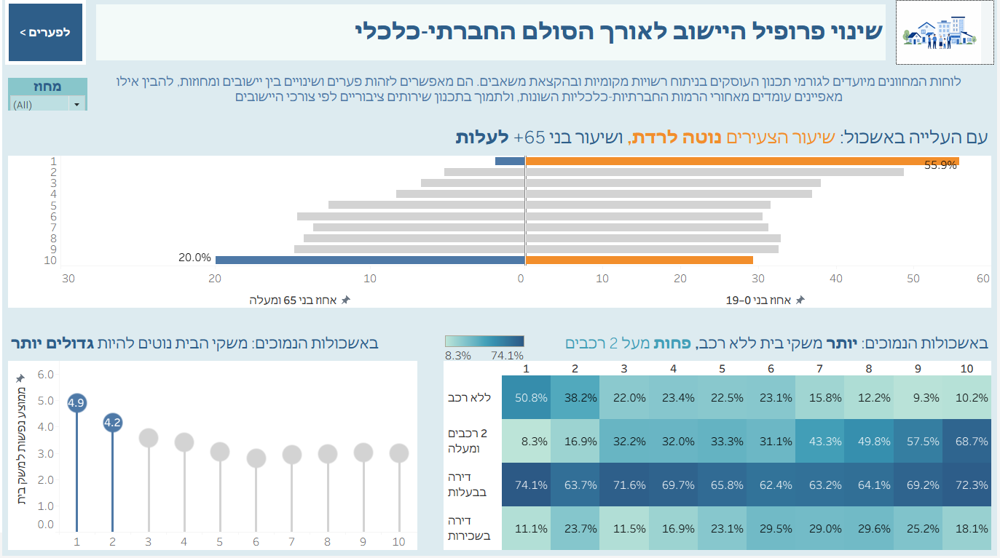
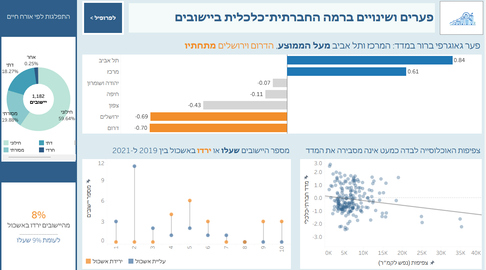

# Israel Socioeconomic Tableau Analysis

Interactive Tableau dashboards analyzing socioeconomic patterns across Israeli localities through district-based filtering and cross-chart interactions.

## Overview

This project was developed as the final project for the **Information Visualization course** as part of the B.Sc. in Computer Science at **Ruppin Academic Center**.

The project explores socioeconomic differences between localities in Israel, focusing on socioeconomic clusters, regional disparities, demographic characteristics, housing and mobility patterns, and changes over time.

The dashboards were designed to transform complex socioeconomic data into clear, interactive visual insights that can support the identification of patterns and areas requiring further attention.

## Dashboards

### Dashboard 1 – Socioeconomic Profile by Cluster

This dashboard examines how population and household characteristics vary across socioeconomic clusters.

It includes:

* Age distribution by socioeconomic cluster
* Average household size
* Housing and mobility patterns
* A district filter that updates all visualizations in the dashboard

### Dashboard 2 – Socioeconomic Gaps and Changes

This dashboard focuses on regional socioeconomic differences and changes in locality rankings over time.

It includes:

* Comparison of socioeconomic gaps between districts
* Localities that increased or decreased in socioeconomic cluster between 2019 and 2021
* KPI comparing the proportion of localities that increased and decreased in cluster
* Population density compared with the socioeconomic index
* Distribution of localities by primary lifestyle category
* Cross-chart interaction, where selecting a district updates the related visualizations

## Key Features

* Interactive district-based filtering
* Cross-chart dashboard interactions
* Multiple visualization techniques:

  * Butterfly chart
  * Lollipop charts
  * Heatmap
  * Scatter plot
  * Donut chart
  * KPI indicators
* Comparison of socioeconomic patterns across clusters and districts
* Analysis of changes in socioeconomic cluster between 2019 and 2021
* Clear visual presentation of complex demographic and socioeconomic data

## Tools

* Tableau
* Excel
* Data Visualization
* Data Analysis

## Project Structure

* `tableau/` – Tableau packaged workbook (`.twbx`)
* `docs/` – Dashboard planning documents and layout sketches
* `images/` – Dashboard screenshots

## Author

**Shiri Weiss**
